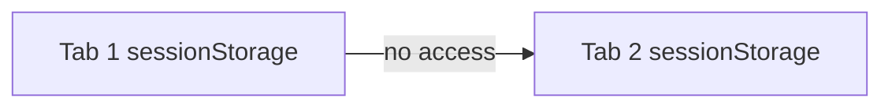

# Keeping State in the Browser: A Mini-Lesson on `sessionStorage`


Imagine you’re teaching a class and you hand every learner a personal notepad when they walk in. They can scribble reminders for themselves—but as soon as they leave the room, the notepad goes into the recycle bin. That notepad is the perfect real-world metaphor for the browser’s **`sessionStorage`** object.

### 1. What *is* `sessionStorage`?

`sessionStorage` is one of the two Web Storage mechanisms (the other is `localStorage`). Both objects implement the same **`Storage` interface**, meaning they share a tiny, intuitive API—mostly three methods you’ll use every day:

```js
setItem(key, value);   // write
getItem(key);          // read
removeItem(key);       // delete
```

If you can remember three verbs—write, read, delete—you already know the interface.

### 2. Scope: One Tab = One Notebook

Where `localStorage` is communal (any tab under the same origin can peek inside), `sessionStorage` is intensely private. Each **tab or window** gets its own isolated copy. Open a second tab on the same site and you’ve got a second, brand-new notebook—nothing shared.



### 3. Lifetime: Until the Tab Closes

“Session” literally means *this browsing session*. As long as the tab stays alive—even if you change pages within it—your data persists. The moment the tab is closed, the browser nukes the notebook. Refreshing, however, does **not** clear the data; the session is still alive.

| Action                              | Keeps data? |
| ----------------------------------- | ----------- |
| Page navigation inside the same tab | ✅           |
| Reload (`F5` / ⌘-R)                 | ✅           |
| Closing the tab/window              | ❌           |
| Re-opening the site in a new tab    | ❌           |

### 4. Practical Example: Remembering Audio Volume

Picture a learning platform where every video has a little audio slider. Users hate it when the volume resets on every page. The fix is a four-line pattern:

```js
// Save when the user changes volume
audio.addEventListener('volumechange', () => {
  sessionStorage.setItem('volume', audio.volume);
});

// Restore on page load
window.addEventListener('DOMContentLoaded', () => {
  const saved = sessionStorage.getItem('volume');
  if (saved !== null) audio.volume = parseFloat(saved);
});
```

Result: hop to a different lesson in the same tab, and the volume feels *sticky*. Close the tab, open a new one—fresh start.

### 5. Quick API Recap

* **Save**

  ```js
  sessionStorage.setItem('key', 'value');
  ```

* **Retrieve**

  ```js
  const data = sessionStorage.getItem('key');
  ```

* **Remove**

  ```js
  sessionStorage.removeItem('key');
  ```

*(Tip: Prefer `JSON.stringify` / `JSON.parse` if the value isn’t a plain string.)*

---

## Check-Your-Understanding Questions

1. **Interface Check:** What three core methods do both `localStorage` and `sessionStorage` share?
2. **Tab Isolation:** If you open the same site in *three* separate tabs, how many independent `sessionStorage` stores exist?
3. **Lifetime Puzzle:** Which of these clears `sessionStorage`—reloading the page, navigating to a different route in the same SPA, or closing the browser tab?
4. **Use-Case Match:** Name one scenario (besides audio volume) where `sessionStorage` is a better fit than `localStorage`.
5. **Code Insight:** In the volume-saving example, why do we parse the saved value with `parseFloat` before assigning it back to `audio.volume`?